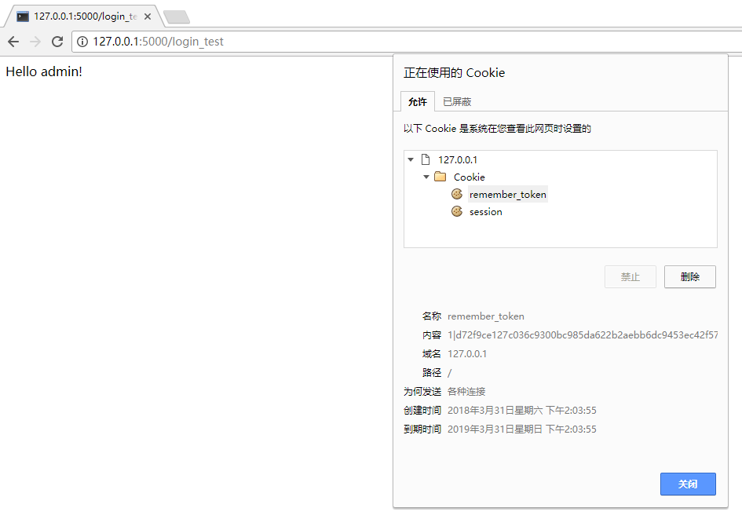
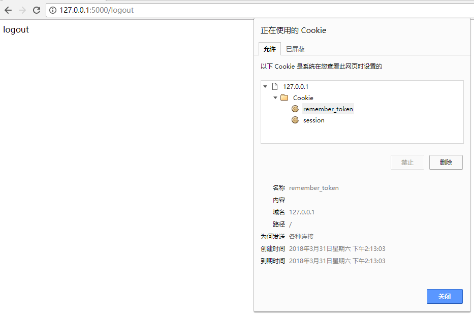
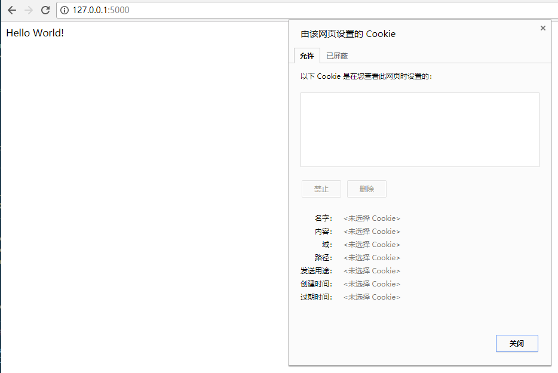
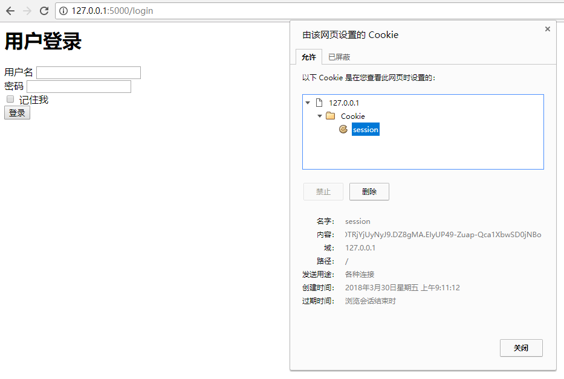
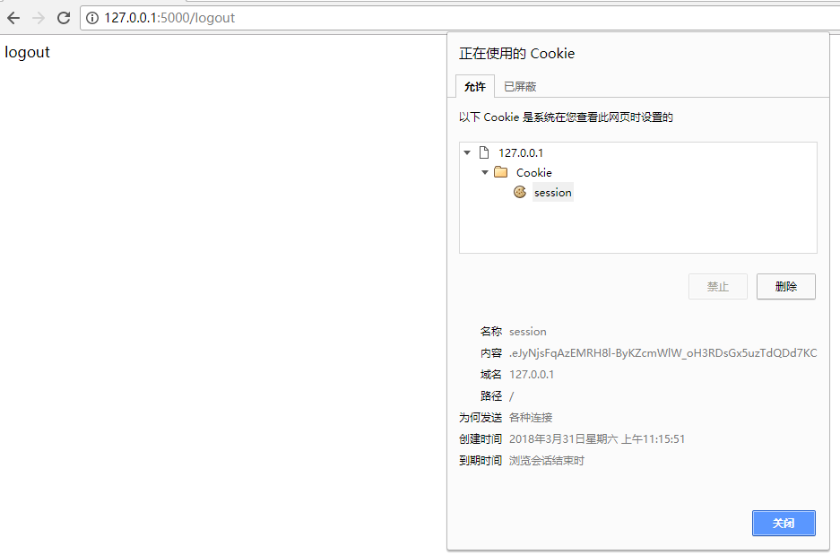

# Hacking flask_login

深入学习Flask_Login模块

# 学习环境

- Windows 10 x64
- Python3
- VSCode
- PowerShell
- Flask_Login v0.4.1

# 准备工作

```PS
# 下载
git clone git@github.com:AngelLiang/hacking_flask_login.git
cd hacking_flask_login

# 搭建虚拟环境
python3 -m venv ./venv
# 启动venv
.\venv\Scripts\Activate.ps1
# 安装依赖包
pip install -r .\requirememts.txt
# 运行app
python3 app.py
```

# 学习笔记

## 提醒

本文不是一篇入门文章，所以需要读者有使用过Flask_Login的经验。另外还需要一点Web开发的知识，比如cookie、session、MVT（Model-View-Template）的设计模式等等。

下面我们开始来深入分析flask_login。

## `LoginManager.init_app()`

每一个Flask模块都会提供一个`init_app()`方法，给我们的flask app对象进行初始化。那么 `LoginManager`的`init_app()`做了什么事情呢？下面来看看源码：

```Python
# flask_login/login_manager.py

class LoginManager(object):
    def __init__(self, app=None, add_context_processor=True):
       # ...

        if app is not None:
            self.init_app(app, add_context_processor)

    def setup_app(self, app, add_context_processor=True):  # pragma: no cover
        warnings.warn('Warning setup_app is deprecated. Please use init_app.',
                      DeprecationWarning)
        self.init_app(app, add_context_processor)

    def init_app(self, app, add_context_processor=True):

        app.login_manager = self

        # 1、设置 request 之后的回调函数
        app.after_request(self._update_remember_cookie)

        # 2、是否禁止登录
        self._login_disabled = app.config.get('LOGIN_DISABLED', False)

        if add_context_processor:
            app.context_processor(_user_context_processor)
```

通过上面代码我们可以知道`LoginManager`创建对象还是调用`setup_app()`方法，最终都是调用`init_app()`方法。而在`init_app()`中有一件很关键的语句是我们注释1那里：`app.after_request(self._update_remember_cookie)`。

设置了一个 requet 完成之后的钩子函数，我们看看`_update_remember_cookie()`做了什么：

```Python
# flask_login/login_manager.py

class LoginManager(object):
    # ...

    def _update_remember_cookie(self, response):

        if 'remember' not in session and \
                current_app.config.get('REMEMBER_COOKIE_REFRESH_EACH_REQUEST'):
            session['remember'] = 'set'

        if 'remember' in session:
            operation = session.pop('remember', None)

            if operation == 'set' and 'user_id' in session:
                self._set_cookie(response)
            elif operation == 'clear':
                self._clear_cookie(response)

        return response

    def _set_cookie(self, response):
        # 设置 cookie 参数，省略
        # ...

        # 1、cookie编码
        data = encode_cookie(text_type(session['user_id']))

        # ...

        # cookie 传参
        response.set_cookie(cookie_name,
                            value=data,
                            expires=expires,
                            domain=domain,
                            path=path,
                            secure=secure,
                            httponly=httponly)

    def _clear_cookie(self, response):
        # 获取 cookie 参数，省略
        # ...

        # 1、删除cookie
        response.delete_cookie(cookie_name, domain=domain, path=path)

```


其中我们比较关注的是`_set_cookie()`方法中注释1的那条语句：`data = encode_cookie(text_type(session['user_id']))`，`encode_cookie()`函数到底做了些什么？我们继续跟踪：

```Python
# flask_login/util.py

import hmac
from hashlib import sha512

def encode_cookie(payload):
    return u'{0}|{1}'.format(payload, _cookie_digest(payload))

# ...

def _cookie_digest(payload, key=None):
    key = _secret_key(key)

    return hmac.new(key, payload.encode('utf-8'), sha512).hexdigest()

# ...

def _secret_key(key=None):
    if key is None:
        key = current_app.config['SECRET_KEY']

    if isinstance(key, text_type):  # pragma: no cover
        key = key.encode('latin1')  # ensure bytes

    return key
```

这里很有意思了！`encode_cookie()`调用`_cookie_digest()`，`_cookie_digest()`对传进来的数据`payload`进行**hmac_sha512**加密，然后返回一个`<payload>|<payload-sign>`的字符串。也就是说，我们客户端保存的cooike的data字段，是经过**hmac_sha512**签名（sign）的！下图测试的时候的cooke：`1|d72f9ce127c036c9300bc985da622b2aebb6dc9453ec42f5796ee87d40c3e13c1f2d8d67fb5424b81c17f290fd98817bd1c1603433ae1890cad78f47aa7d87f4`





于是，从以上分析我们可以总结如下：

- `flask_login`注册了一个`flask.after_request`钩子函数，来设置cooike
- 当登录时选择“记住我”的功能的时候，`flask_login`会在浏览器设置cookie
- “记住我”功能默认是用user model的**id值**和其sign保存到cookie，没有进行加密！
- 当我们登出的时候，会清空cookie的相关remember_token字段

现在，还有一个问题，如果开发者要自己的注册`flask.after_request`钩子函数，会不会覆盖掉`flask_login`注册的钩子函数呢？我查了一下资料并做了下测试，结果是多虑了。因为`flask.after_request`用一个队列保存注册进来的钩子函数，之后flask应该会对这个函数队列进行遍历调用。这个队列，我就称之为“钩子函数链”。





## `login_user()`

使用过Flask_Login模块的都知道，`LoginManager.login_user()`是设置用户登录的接口。我们来看一下`login_user()`的源码。

```Python
# flask_login/utils.py

from flask import session

def login_user(user, remember=False, duration=None, force=False, fresh=True):

    # 1、检查是否可以登录（force表示强制登录，is_active表示用户已激活）
    if not force and not user.is_active:
        return False
    
    # 2、从 user 对象获取 id 属性，然后设置 session 字段
    user_id = getattr(user, current_app.login_manager.id_attribute)()
    session['user_id'] = user_id
    session['_fresh'] = fresh
    session['_id'] = current_app.login_manager._session_identifier_generator()

    # 3、如果设置了"记住我"，则...
    if remember:
        # 设置 session 的 remember 为 set
        session['remember'] = 'set'
        if duration is not None:
            try:
                # equal to timedelta.total_seconds() but works with Python 2.6
                session['remember_seconds'] = (duration.microseconds +
                                               (duration.seconds +
                                                duration.days * 24 * 3600) *
                                               10**6) / 10.0**6
            except AttributeError:
                raise Exception('duration must be a datetime.timedelta, '
                                'instead got: {0}'.format(duration))

    # 4、把 user 设置 request 栈顶的 user（需要先了解Flask的原理）
    _request_ctx_stack.top.user = user

    # 5、发送 login 信号
    user_logged_in.send(current_app._get_current_object(), user=_get_user())
    return True
```

我在上面代码写了比较详细的注释，但是还是有些地方没有分析透，下面一一道来：

### `getattr(user, current_app.login_manager.id_attribute)()`

```Python
def login_user(user, remember=False, duration=None, force=False, fresh=True):
    
    # ...
    
    # 2、从 user 对象获取 id 属性，然后设置 session 字段
    user_id = getattr(user, current_app.login_manager.id_attribute)()   # 2.1
    session['user_id'] = user_id
    session['_fresh'] = fresh
    session['_id'] = current_app.login_manager._session_identifier_generator()  # 2.2
```

下面我们来看看标有`2.1`注释的那一行：`user_id = getattr(user, current_app.login_manager.id_attribute)()`。

其中`id_attribute`是什么东西呢？跟踪代码到`flask_login/login_manager.py`可以看到`login_manager`有一个属性`id_attribute`，并且这个属性赋值了 `ID_ATTRIBUTE` 。查看`flask_login/config.py`可知：`ID_ATTRIBUTE = 'get_id'`。

```Python
# flask_login/login_manager.py
class LoginManager(object):
    def __init__(self, app=None, add_context_processor=True):
        # ...
        self.id_attribute = ID_ATTRIBUTE
```

```Python
# flask_login/config.py
# ...
ID_ATTRIBUTE = 'get_id'
```

因此，`getattr(user, current_app.login_manager.id_attribute)()`，其实就是
`getattr(user, "get_id")()`，也就是`user.get_id()`。但是查看我们app的User Model，并没有`get_id`属性（方法）啊！噢对了！我们的User Model继承了flask_login的`UserMixin`，说不准里面有`get_id`属性呢？查看`flask_login/mixins.py`：

```Python
# `flask_login/mixins.py`

class UserMixin(object):
    # ...

    def get_id(self):
        try:
            return text_type(self.id)
        except AttributeError:
            raise NotImplementedError('No `id` attribute - override `get_id`')
```

可以找到`get_id`方法，说明我们的`user.get_id()`是能成功调用的。

当然，在flask_login的官网文档中也写道，因为cookie是获取`user.get_id()`的值存到cookie，如果你不希望用`user_id`，可以在自己的User Model里覆写`get_id()`方法，比如返回一个token。示例如下：

```Python
class User(db.Model, UserMixin):
    # ...

    def get_id(self):
        return self.generate_token()

@login_manager.user_loader
def load_user(user_id):
    current_app.logger.debug("user_id: %s" % user_id)
    # verify_token
    data = User.verify_token(user_id)
    user_id = data.get("id")

    return User.query.get(user_id)
```

### `current_app.login_manager._session_identifier_generator()`

```Python
def login_user(user, remember=False, duration=None, force=False, fresh=True):
    
    # ...
    
    # 2、从 user 对象获取 id 属性，然后设置 session 字段
    user_id = getattr(user, current_app.login_manager.id_attribute)()   # 2.1
    session['user_id'] = user_id
    session['_fresh'] = fresh
    session['_id'] = current_app.login_manager._session_identifier_generator()  # 2.2
```

我们接下来看注释`2.2`那一行，有一个很长很长的方法：`current_app.login_manager._session_identifier_generator()`

跟踪代码后进入到`flask_login/login_manager.py`：

```Python
# flask_login/login_manager.py

class LoginManager(object):
    def __init__(self, app=None, add_context_processor=True):
        # ...

        self._session_identifier_generator = _create_identifier
```

继续跟踪`_create_identifier`，进入到了`flask_login/utils.py`：

```Python
# flask_login/utils.py

from hashlib import sha512
from flask import request

# ...

def _get_remote_addr():
    address = request.headers.get('X-Forwarded-For', request.remote_addr)
    if address is not None:
        # An 'X-Forwarded-For' header includes a comma separated list of the
        # addresses, the first address being the actual remote address.
        address = address.encode('utf-8').split(b',')[0].strip()
    return address

def _create_identifier():
    # 1、获取请求头 User-Agent 字段
    user_agent = request.headers.get('User-Agent')
    if user_agent is not None:
        user_agent = user_agent.encode('utf-8')

    # 2、合并数据，包括客户端IP和 user_agent
    base = '{0}|{1}'.format(_get_remote_addr(), user_agent)
    if str is bytes:
        base = text_type(base, 'utf-8', errors='replace')  # pragma: no cover
    
    # 3、加密
    h = sha512()
    h.update(base.encode('utf8'))

    return h.hexdigest()
```

有意思了！`_create_identifier()`居然有对数据加密的代码。流程是这样的：首先获取请求头`User-Agent`字段然后，合并了下客户端IP和`user_agent`的数据，最后对数据进行`sha512`加密并返回。`_get_remote_addr()`则是从`X-Forwarded-For`请求头部或`flask.request.remote_addr`从获取客户端IP。

总的来说，当我们成功登录后，`flask_login`会在`session`里面存入三个字段：`user_id`、`_fresh`和`_id`。其中，`user_id`顾名思义，默认保存的是user model的id值，除非覆写了user model的`get_id()`方法；`_fresh`则是标记该请求是否是“新鲜的”，也就是表示这一次请求用户是用密码验证过一次了，还是只是普通的登录状态；而最后的`_id`字段，则存放是用户端IP和User-Agent的加密数据。


## `@login_required`

用户登录之后，就可以访问带有`@login_required`装饰器的`view`了。那么我们来分析看看这个装饰器做了什么工作

```Python
# flask_login/utils.py


def login_required(func):
    @wraps(func)
    def decorated_view(*args, **kwargs):
        if request.method in EXEMPT_METHODS:
            return func(*args, **kwargs)
        elif current_app.login_manager._login_disabled:
            return func(*args, **kwargs)
        # 如果 user 没有被认证，则调用 login_manager.unauthorized() 方法
        elif not current_user.is_authenticated:
            return current_app.login_manager.unauthorized()
        return func(*args, **kwargs)
    return decorated_view
```

很显然，`login_required`是一个装饰器，其中最关键的只是第三条判断语句：如果 user 没有被认证，则调用`login_manager.unauthorized()`方法。其他情况则回到 view 视图函数。`login_manager.unauthorized()`的实现这里就不写了。


## `logout_user()`

下面来分析`logout_user()`

```Python
# flask_login/utils.py

from flask import session

def _get_user():
    if has_request_context() and not hasattr(_request_ctx_stack.top, 'user'):
        current_app.login_manager._load_user()

    return getattr(_request_ctx_stack.top, 'user', None)

def logout_user():

    # 1、获取 user 对象
    user = _get_user()

    # 2、判断下面字段是否在 session 里面，如果有则 pop
    if 'user_id' in session:
        session.pop('user_id')

    if '_fresh' in session:
        session.pop('_fresh')

    # 3、获取 cookie 中存储数据值的key，然后清理 remeber 字段和 remember_seconds 字段
    cookie_name = current_app.config.get('REMEMBER_COOKIE_NAME', COOKIE_NAME)
    if cookie_name in request.cookies:
        session['remember'] = 'clear'
        if 'remember_seconds' in session:
            session.pop('remember_seconds')

    # 4、发送 logout 信号
    user_logged_out.send(current_app._get_current_object(), user=user)

    current_app.login_manager.reload_user()
    return True
```



## @login_manager.user_loader

在使用flask_login过程中我们也知道，我们需要给`login_manager.user_loader`设置一个回调函数，示例如下：

```Python
@login_manager.user_loader
def load_user(user_id):
    return User.query.get(user_id)
```

`login_manager.user_loader`是怎么实现的呢？我们来看下面代码：

```Python
# flask_login/login_manager.py

from flask import _request_ctx_stack, session

class LoginManager(object):

    def __init__(self, app=None, add_context_processor=True):
        # ...

        self.user_callback = None

    # ...

    def user_loader(self, callback):
        self.user_callback = callback
        return callback

    def reload_user(self, user=None):
        ctx = _request_ctx_stack.top

        if user is None:
            # 1、获取 session 中的 user_id
            user_id = session.get('user_id')
            # 2、如果 user_id 为 None，设置为匿名用户
            if user_id is None: 
                ctx.user = self.anonymous_user()
            else:
                if self.user_callback is None:
                    raise Exception(
                        "No user_loader has been installed for this "
                        "LoginManager. Refer to"
                        "https://flask-login.readthedocs.io/"
                        "en/latest/#how-it-works for more info.")

                # 3、调用回调函数，返回一个 user 对象，并设给 ctx.user
                user = self.user_callback(user_id)
                # 4、如果为 None，则设 ctx.user 为匿名用户
                if user is None:    
                    ctx.user = self.anonymous_user()
                else:
                    ctx.user = user
        else:
            ctx.user = user
```

由此可见，`login_manager.user_loader`设置回调函数给`self.user_callback`，然后`login_manager.reload_user`调用`self.user_callback`获取用户对象（注释3）。

因此，`login_manager.user_loader`的作用就是设置一个把 cookie 数据转换为对应的user model。


# 其他

本文Flask_Login学习版本为0.4.1。不同版本的实现方式会有点差别，在这里要留意。Flask_Login v0.4.1官网文档：http://flask-login.readthedocs.io/en/0.4.1/

